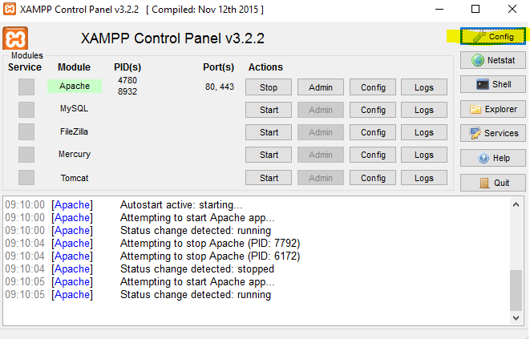
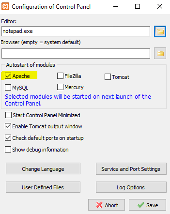
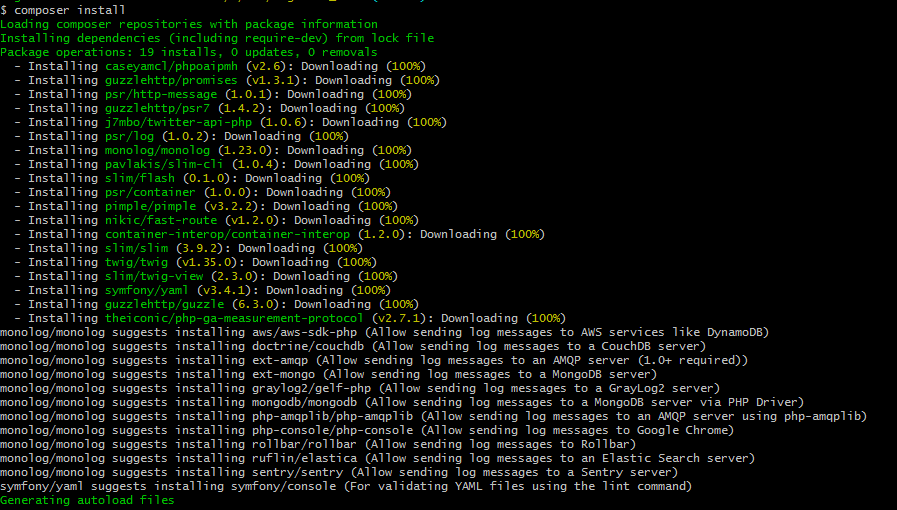

## 1. INSTALL AND CONFIGURE APACHE + PHP SERVER IN LOCAL MACHINE
### 1.1 Download and install XAMPP (apache + php server)
**[DOWNLOAD XAMPP](https://www.apachefriends.org/download.html)**

During the installation process click "Next" for all the steps.

After installed, open XAMPP control panel, go to Config and check Apache at the list "Autostart of modules":





Save and restart Apache.


### 1.2 Download and install Composer (dependency management in PHP)
**[DOWNLOAD COMPOSER](https://getcomposer.org/Composer-Setup.exe)**

During the installation process click "Next" for all the steps. 


### 1.3 Download and install Git client for Windows
**[DOWNLOAD GIT](https://git-scm.com/download/win)**

During the installation process click "Next" for all the steps. 

## 2. CLONING ORDA SOURCE FILES FROM GITHUB
Using git Bash you have just installed run the following commands:
```
- cd c:
- mkdir www
- cd c:\www
- git clone https://src.shef.ac.uk/cs1jk/figshare_orda.git
- enter your credentials for src.shef.ac.uk github account
```    

## 3. INSTALLING PHP LIBRARIES AND DEPENDENCIES 
You now have the following dir structure: **c:/www/figshare_orda**. Using Git Bash, go into the figshare_orda dir and run the following command: 
``` composer install ```


## 4. CONFIGURING VIRTUAL HOST 
Open and edit the C:\xampp\apache\conf\extra\httpd-vhosts.conf file adding the following lines at the end of the file:
```
<VirtualHost *:80>
    ServerName www.orda
    ServerAdmin webmaster@localhost
    DocumentRoot c:/www/figshare_orda/public
    ErrorLog "logs/default-error.log"
    CustomLog "logs/default-access.log" common

    SetEnv APPLICATION_ENV marcelo
    SetEnv SLIM_MODE development

    <Directory c:/www/figshare_orda/public>
        DirectoryIndex index.php
        AllowOverride All
        Require all granted
    </Directory>
</VirtualHost>
```
## 5. ADDING HOST TO WINDOWS
Open and edit the C:\Windows\System32\drivers\etc\hosts file  following line at the end of the file:
```
127.0.0.1   www.orda
```

## 6. RUN!
Using XAMPP Control Panel, restart Apache and access http://www.orda from your favorite browser

